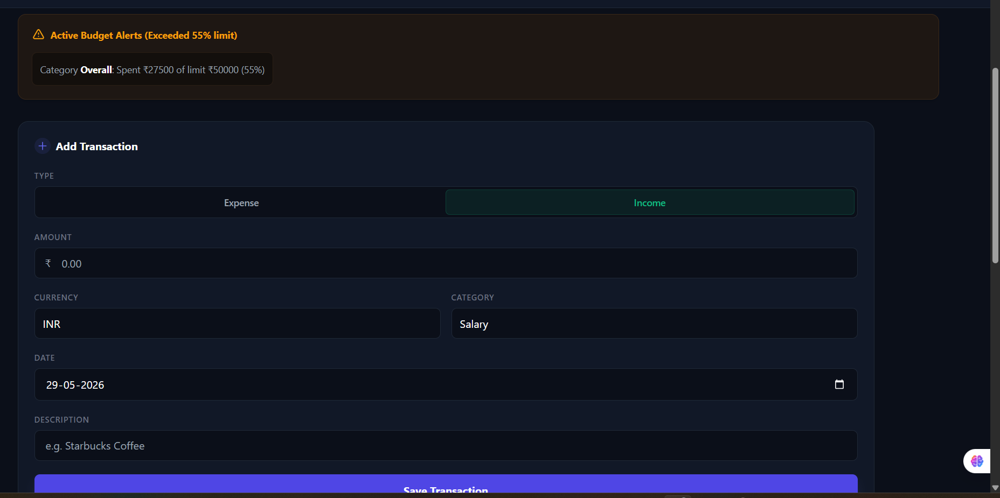

# 💰 Smart Expense Tracker

A modern, premium dark-themed personal finance management application built with the MERN stack. This dashboard helps users track their income and expenses, visualize financial trends, and manage budgets efficiently with a beautiful glassmorphism UI.

## 📸 Screenshots

### 🖥️ Main Financial Dashboard


### 🔐 Authentication (Login & Registration)
<p align="center">
  
  
</p>

### 📊 Analytics & Budget Alerts
<p align="center">
  
  
</p>

---

## ✨ Features

- 📊 **Visual Analytics:** Interactive Doughnut and Line charts using Recharts for cash flow trends and category distributions.
- 💱 **Multi-Currency Support:** Instantly switch between USD ($), BDT (৳), INR (₹), and EUR (€) with auto-conversion and local storage saving.
- 🌓 **Premium UI/UX:** A highly responsive, modern dark mode dashboard featuring glassmorphism and modern Tailwind CSS design patterns.
- 📈 **Income & Expense Tracking:** Log transactions effortlessly and monitor your real-time net balance.
- 🔔 **Budget Alerts:** Visual warnings and progress bars when category spending limits are exceeded.
- 🔄 **Real-time Sync:** Seamlessly fetches and updates data without page reloads.

## 🛠️ Tech Stack

**Frontend:**
- React.js
- Tailwind CSS
- Recharts (for data visualization)
- React Router DOM

**Backend:**
- Node.js
- Express.js
- MongoDB (Mongoose)
- CORS

## 🚀 Getting Started

Follow these steps to run the project locally on your machine.

### Prerequisites
- [Node.js](https://nodejs.org/) installed
- [MongoDB](https://www.mongodb.com/) installed and running locally

### Installation

1. **Clone the repository:**
   ```bash
   git clone https://github.com/dalimkumar452-sudo/Smart-Expense-Tracke.git
Setup the Backend:

Bash
cd server
npm install
Start the backend server:

Bash
node server.js
The server will run on http://localhost:5000

Setup the Frontend:
Open a new terminal and navigate to the client folder:

Bash
cd client
npm install
Start the React development server:

Bash
npm run dev
The application will open on http://localhost:5173

💡 Future Enhancements (Coming Soon)
📄 Receipt OCR: Scan invoice receipts using an OCR text processor to auto-fill transaction details.

📥 CSV Bank Statement Import: Upload standard banking exports to automatically log multiple expenses.

🔐 Authentication: JWT-based secure user login and registration system.

👤 Author
Dalim Kumar

GitHub: https://github.com/dalimkumar452-sudo